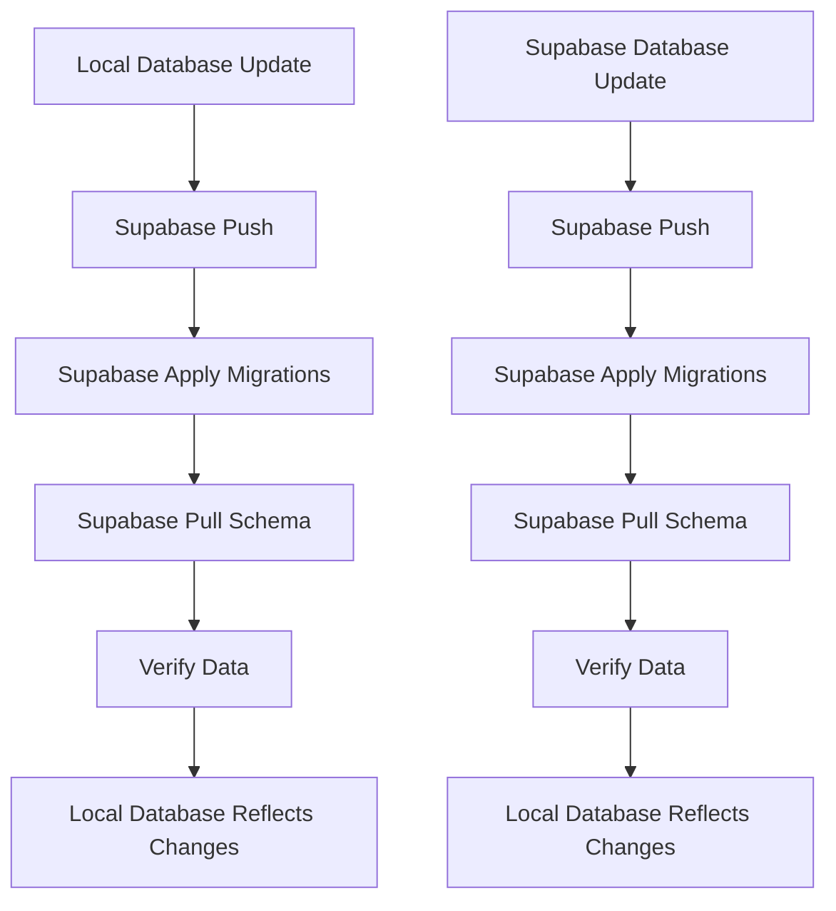

# ONUS Cloud Connection

## Overview
ONUS Cloud Connection is a web application designed to facilitate collaboration and communication among musicians. It provides features such as forums, messaging, notifications, and profile management.

## Features
- **Forum**: A platform for musicians to discuss topics, share ideas, and engage in community discussions.
- **Messaging**: A messaging system for musicians to send nudges and communicate privately.
- **Notifications**: Real-time notifications for collaboration requests, follows, song reactions, and more.
- **Profile Management**: Manage musician profiles, including bio, avatar, and role.

## Setup
To set up and run the ONUS Cloud Connection app, follow these steps:

1. **Clone the Repository**:
   ```sh
   git clone https://github.com/your-repo/onus-cloud-connection.git
   cd onus-cloud-connection
   ```

2. **Install Dependencies**:
   ```sh
   npm install
   ```

3. **Start the Application**:
   ```sh
   docker-compose down && docker-compose up -d
   npx supabase start
   npm run dev
   ```

## Database Migrations
The application uses Supabase for its database. The following migrations are applied to the `profiles` table:

- **Add `username` Column**:
  ```sql
  ALTER TABLE profiles
  ADD COLUMN username TEXT UNIQUE NOT NULL;
  ```

- **Add `role` Column**:
  ```sql
  ALTER TABLE profiles
  ADD COLUMN role TEXT NOT NULL DEFAULT 'user';
  ```

- **Seed Data**:
  ```sql
  INSERT INTO profiles (username, email, role) VALUES
  ('user1', 'user1@example.com', 'user'),
  ('user2', 'user2@example.com', 'user'),
  ('user3', 'user3@example.com', 'admin');
  ```

## Data Update Flow Chart



## Commands Used Today
- **Create Migration for `username` Column**:
  ```sh
  npx supabase migration new add_username_to_profiles
  ```

- **Add `username` Column to Migration File**:
  ```sh
  mv supabase/migrations/20250312170827_add_username_to_profiles.sql supabase/migrations/20250312080001_add_username_to_profiles.sql
  ```

- **Create Migration for `role` Column**:
  ```sh
  npx supabase migration new add_role_to_profiles
  ```

- **Add `role` Column to Migration File**:
  ```sh
  mv supabase/migrations/20250312171202_add_role_to_profiles.sql supabase/migrations/20250312080002_add_role_to_profiles.sql
  ```

- **Rename `seed_data` Migration File**:
  ```sh
  mv supabase/migrations/20250312080000_seed_data.sql supabase/migrations/20250312080003_seed_data.sql
  ```

- **Push Migrations to Remote Database**:
  ```sh
  npx supabase db push --include-all
  ```

- **Pull Schema from Remote Database**:
  ```sh
  npx supabase db pull
  ```

- **Verify `role` Column in Migration File**:
  ```sh
  npx supabase db exec "SELECT column_name FROM information_schema.columns WHERE table_name='profiles' AND column_name='role';"
